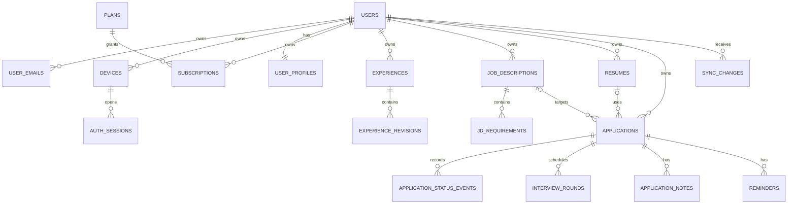

# 数据库设计总览

> 状态：Approved Design v1.0  
> 日期：2026-07-26  
> 数据库：PostgreSQL 18

字段级 Schema 已拆分到 [`docs/database/`](../database/README.md)：

1. [Schema 审阅索引](../database/README.md)
2. [Identity 与 Subscription](../database/01-identity-entitlement.md)
3. [Experience、JD、Resume](../database/02-core-assets.md)
4. [Application Tracker](../database/03-application-tracker.md)
5. [Sync 与幂等](../database/04-sync-reliability.md)

本文件只记录跨模块架构决策，避免演变成一份不可审核的上帝 Schema 文档。

## 1. 数据模型目标

- 四大核心业务保持独立聚合；
- 所有同步实体支持离线 UUIDv7、乐观锁和软删除；
- 数据库通过复合外键提供第二层用户所有权保护；
- Resume 只保存云端当前文档；
- Experience content revision 和 Application status event 保留不可变历史；
- JD requirements 作为 JD 聚合原子更新；
- 同步日志只存变更键，不复制大型正文；
- 普通列表不读取 Resume JSONB 等大字段。

## 2. 关系概览



## 3. 事务边界

### Experience 正文更新

```text
锁定并校验 Experience 版本
→ 插入不可变 ExperienceRevision
→ 更新 current_revision_id 和 entity_version
→ 插入 SyncChange
→ 提交
```

### JD 完整更新

```text
锁定并校验 JD 版本
→ 校验 requirement ID/顺序
→ 批量 insert/update/delete requirements
→ 更新 JD hash 和 entity_version
→ 插入一条 JD SyncChange
→ 提交
```

### Resume Replace

```text
同时比较 entity_version 与 content_hash
→ 原子替换 structured/content/质量资产
→ 更新版本与 hash
→ 插入 SyncChange
→ 提交
```

### Application Transition

```text
锁定 Application
→ 校验 expectedVersion 和状态边
→ 更新当前状态与版本
→ 插入不可变 StatusEvent
→ 插入 Application/Event SyncChange
→ 保存 operation result
→ 提交
```

外部邮件、Redis 和未来对象存储调用都不允许放在上述事务中。

## 4. 性能策略

- 列表统一使用 `(updated_at, id)` 或 `(applied_at, id)` keyset cursor；
- Application 看板使用 `(user_id, status, applied_at DESC, id DESC)` 部分索引；
- 单用户 Experience 上限 200，不为模糊搜索提前引入全文检索；
- Resume 列表使用摘要 projection，不返回 `structured`；
- Sync Pull 先读一页 keys，再按类型批量 hydrate；
- PostgreSQL 是唯一业务真相源，Redis 不缓存普通 CRUD；
- 索引必须对应实际 Repository query，并在压测阶段检查执行计划。

## 5. v1 取舍

- 不使用 PostgreSQL enum，使用 CHECK；
- 不使用数据库 trigger 自动写 SyncChange，事务由应用层显式编排；
- 不建通用 BaseRepository；
- 不建 Resume 云端版本表；
- 不建 Agent、RAG、embedding、Material、通用 Outbox 或通用审计表；
- v1 业务墓碑不物理回收，账号清除时统一处理；
- 支付未确定前只保存 Plan、Entitlement 和当前 Subscription。

## 6. Schema 到 Migration

Schema v1 已完成用户审核。后续实现应按依赖拆成以下 Goose Migration：

```text
00002_identity_and_subscription.sql
00003_experience_jd_resume.sql
00004_application_tracker.sql
00005_sync_and_reliability.sql
00006_seed_development_plan.sql
```

每个 Migration 只负责结构变化；开发账号和演示业务数据使用独立 seed 命令。
设计通过不代表 Migration 已实现或已在 PostgreSQL 执行。
