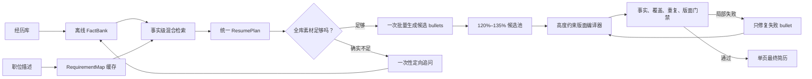

# 证据优先的简历生成编译器 V2 设计

**状态**：提案，待实施
**日期**：2026-07-19
**优先级**：P0
**目标**：在不编造事实的前提下，稳定生成占用 A4 可用高度 `85%–98%` 的单页简历，并将常规生成耗时降低到 `15–30s`、P95 降低到 `45s` 以内。

## 1. 文档定位

本文档定义简历生成链路的 V2 总体架构、核心算法、领域模型、性能预算、质量门禁、迁移顺序和验收标准。

它不是对现有 Prompt 的局部调整，而是把当前不可控的“多轮大模型写作流程”改造为：

```text
事实库 → 岗位要求 → 事实检索 → 约束规划 → 批量写作 → 版面编译 → 确定性验证
```

相关历史文档仍可作为实现参考：

- [`resume-quality-and-speed-plan-2026-07-18.md`](./resume-quality-and-speed-plan-2026-07-18.md)：已有质量门、排版搜索和 Provider 优化记录；
- [`resume-one-page-90-percent-strategy.md`](./resume-one-page-90-percent-strategy.md)：单页与字体策略；
- [`resume-layout-fit-contract-2026-07-17.md`](./resume-layout-fit-contract-2026-07-17.md)：前后端版面契约；
- [`new-agent-architecture-plan.md`](./new-agent-architecture-plan.md)：项目整体架构约束。

V2 实施后，以本文定义的生成主流程、统一 `ResumePlan` 和 `85%–98%` 页面门禁为准。旧文档中的实现细节若与本文冲突，应在迁移阶段更新或标记为历史方案。

## 2. 结论摘要

真实链路复核表明，当前半页简历的主要原因不是经历库不足，也不只是模型写作能力弱，而是生成链路在多个阶段持续损失可用内容：

1. 相关度和 claim coverage 数据异常归零，选择器退化为主要按时间排序；
2. 5 条可叙述的工作/项目经历只选中 2 条，3 条高价值经历被提前淘汰；
3. 选择结果、匹配计划和内容预算分别维护不同的 bullet 数量；
4. 生成器又单独限制每段经历最多生成 6 条；
5. 候选池本身不足以填满页面，排版阶段仍继续合并和删除；
6. 内容不足判断只看当前选择结果，没有先穷尽全经历库；
7. 每段经历独立调用模型，叠加 Provider 和业务层重试，最慢调用决定总延迟；
8. 前端同步等待 120 秒，而真实后端完成时间可能超过 170 秒。

因此，V2 的核心原则是：

> 大模型只负责把已选定的真实事实写成高质量 bullet；素材选择、篇幅预算、页面填充和质量门禁由可解释的确定性算法负责。

## 3. 真实问题证据

### 3.1 素材充足但选择器丢弃了高价值经历

本次真实线程中共有 7 条相关记录，其中包括 5 条可用于正文叙述的工作或项目经历。系统最终只选择了 2 条正文经历，并丢弃了：

| 经历 | 原始内容长度 | 可用 claims | 结果 |
|---|---:|---:|---|
| AI 算法工程师（数据处理、大模型备案） | 327 字 | 11 | 被丢弃 |
| 基于 3D 运动轨迹跟踪的艾灸考评系统 | 458 字 | 17 | 被丢弃 |
| 基于深度学习的流量分析与控制系统 | 252 字 | 6 | 被丢弃 |

这些经历的 `relevance_score` 和 `claim_coverage` 都异常为 `0`。当前选择公式因此主要依赖 recency，导致最新但岗位匹配度较弱的经历反而被优先选择。

当前选择器位置：

- [`app/domain/resume/experience_selector.py`](../app/domain/resume/experience_selector.py)

### 3.2 三套内容预算互相矛盾

真实链路中出现了三种不同的 bullet 目标：

| 阶段 | 目标/上限 |
|---|---:|
| `experience_selection_result` | 26 条 |
| `content_budget` | 14 条 |
| 单段经历生成器 | 最多 6 条 |

最终只生成了 13 条正文候选，版面整理后剩余 9 条。页面使用率为 `57.98%`，仍有约 `75mm` 可用高度，却没有回到未选择素材继续补足内容。

### 3.3 延迟由模型扇出和嵌套重试放大

一次真实请求的关键耗时：

| 操作 | 耗时 |
|---|---:|
| 补充内容的事实抽取 | 约 31s |
| 一段经历生成 | 约 42s |
| 另一段经历生成，包含重试 | 约 132s |
| 后端完整请求 | 约 172s |
| 前端超时阈值 | 120s |

即使各经历并行生成，总耗时仍取决于最慢模型调用。Provider 重试、structured output 协议回退和业务层外层重试还可能形成乘法放大。

## 4. 设计目标与非目标

### 4.1 设计目标

1. 有足够真实素材时，单页 A4 使用率稳定处于 `85%–98%`；
2. 全经历库存在合格未使用事实时，禁止触发内容补充；
3. 每条最终 bullet 都能追溯到稳定的 `source_fact_ids`；
4. 常规生成只进行一次批量简历写作模型调用；
5. 失败时只局部修复，不重新生成整份简历；
6. 常规总耗时 `15–30s`，冷启动小于 `45s`，极端情况小于 `60s`；
7. HTTP 请求在 1 秒内返回运行标识，长任务通过 SSE 报告进度；
8. 选择、淘汰、补充和版面决策均可解释、可观测、可回放；
9. 严格遵守项目依赖方向：

```text
api → graphs → tools → domain ← infra
                 ↓
           rag / memory / providers
                 ↓
               core
```

### 4.2 非目标

1. 不通过编造事实、空泛 Summary 或重复内容填充页面；
2. 不以增加整份简历 Self-Review 轮数提高质量；
3. 不依赖某一个特定 LLM Provider；
4. 不以简单延长前端超时时间掩盖后端延迟；
5. 不在 V2 中改变浏览器 print-to-PDF 的既有决策；
6. 不同时生成多份对外可见的简历变体。

## 5. 总体架构



生成主链路划分为两个生命周期：

1. **离线/写入时处理**：经历变更后建立和缓存 FactBank；
2. **在线/请求时处理**：解析 JD、检索事实、规划篇幅、批量写作、版面编译和验证。

## 6. 核心领域模型

V2 必须建立单一事实来源，避免多个 state 字段重复表达同一决策。

### 6.1 FactRecord

每条经历在保存或产生 revision 时拆解为可引用的原子事实：

```python
class FactRecord:
    fact_id: str
    experience_id: str
    source_revision_id: str
    source_revision_hash: str
    action: str | None
    object: str | None
    method: str | None
    technologies: tuple[str, ...]
    scope: str | None
    constraint: str | None
    result: str | None
    metrics: tuple[str, ...]
    time_range: str | None
    source_text: str
    strength_score: float
    embedding_ref: str | None
```

要求：

- `fact_id` 在同一个 revision 中稳定；
- 所有生成文本必须引用一个或多个 `fact_id`；
- revision hash 未变化时不得重复抽取；
- 原始文本、结构化事实和向量索引必须可独立重建；
- FactBank 抽取失败不阻塞经历保存，可进入后台重试队列。

### 6.2 Requirement

```python
class Requirement:
    requirement_id: str
    category: str
    description: str
    keywords: tuple[str, ...]
    importance: Literal["must_have", "preferred", "optional"]
    weight: float
```

JD 解析结果使用规范化 JD hash 缓存。解析必须区分：

- 候选人资格要求；
- 岗位职责；
- 技术关键词；
- 领域与业务场景；
- 软技能和可选要求。

### 6.3 ResumePlan

`ResumePlan` 是选择、预算和生成阶段唯一的权威计划：

```python
class ResumePlan:
    requirements: tuple[Requirement, ...]
    selected_experience_ids: tuple[str, ...]
    selected_fact_ids: tuple[str, ...]
    fact_requirement_map: dict[str, tuple[str, ...]]
    section_height_budgets_mm: dict[str, float]
    experience_height_budgets_mm: dict[str, float]
    target_candidate_lines: int
    target_final_usage_ratio: float
    selection_reasons: dict[str, tuple[str, ...]]
    rejection_reasons: dict[str, tuple[str, ...]]
```

V2 中应停止让以下状态分别决定 bullet 数量：

- `experience_selection_result`；
- `matching_plan`；
- `content_budget`。

迁移期可以保留兼容字段，但它们只能由 `ResumePlan` 投影产生，不能反向参与决策。

### 6.4 CandidateBullet

```python
class CandidateBullet:
    bullet_id: str
    experience_id: str
    text: str
    source_fact_ids: tuple[str, ...]
    covered_requirement_ids: tuple[str, ...]
    quality_score: float
    estimated_lines: int
    estimated_height_mm: float
    length_variant: Literal["short", "medium", "long"]
```

### 6.5 CompiledResume

```python
class CompiledResume:
    selected_bullet_ids: tuple[str, ...]
    structured_resume: dict
    layout_report: dict
    coverage_report: dict
    grounding_report: dict
    plan_version: str
```

## 7. 端到端算法

### 7.1 阶段 A：经历写入时建立 FactBank

经历新增或修改后异步执行：

1. 对原始内容规范化并计算 revision hash；
2. hash 命中时直接复用已有 FactBank；
3. hash 未命中时拆解为原子事实；
4. 对事实进行去重、字段校验和强度评分；
5. 生成 lexical tokens 与 embeddings；
6. 持久化 facts 和索引；
7. 标记该 revision 的 FactBank 状态为 ready。

事实抽取可以使用模型，但它属于经历入库的后台成本，而不是每次生成简历的在线成本。

如果在线生成遇到尚未完成 FactBank 的新 revision，可以使用确定性句子切分作为临时 fallback，同时安排后台重建，不能把整个请求阻塞 30 秒以上。

### 7.1.1 阶段 A 实施完成记录（2026-07-19）

**状态：已完成。** 本次实施已经把经历保存后的同步 claims/embedding 索引替换为 revision-aware FactBank 和 PostgreSQL 持久化后台任务，阶段 A 不再把 LLM 抽取延迟放在经历写入请求内。

已完成内容：

1. 在 `app/domain/resume/factbank/` 建立纯领域 FactBank 模块，包含 `FactRecord`、任务模型、Repository Protocol、内容规范化、SHA-256 revision hash、稳定 fact ID、来源校验、去重、确定性强度评分、lexical tokens 和中英文句子 fallback；
2. 新增 Alembic `0018_revision_factbank`，为 `experience_revisions` 增加 hash、状态、版本、attempt、lease、retry 和 ready 信息，并新增带 JSONB、GIN 与 pgvector 索引的 `fact_records` 表；
3. 经历创建、新 revision、导入候选接受和简历补充统一通过 revision 写入事务进入 `pending`，`ExperienceService` 不再调用或等待 Provider；
4. 新增 `StructuredFactExtractor`、`FactBankProcessor` 和 `FactBankWorker`，状态机为 `pending → extracting → indexing → ready`，失败进入 `retry`，超过上限进入 `failed`；
5. Worker 使用 `FOR UPDATE SKIP LOCKED`、worker ownership 和 lease，支持多实例并发、进程重启恢复、过期任务重新领取，并阻止失去 lease 的旧 Worker 覆盖结果；
6. 抽取结果要求 `source_text` 能定位到规范化原文，结构化字段、技术、数字和时间必须能由该来源文本直接支持；结构化 facts 会先持久化，embedding 失败后的重试不会重新抽取；
7. facts 与整段 revision 使用一次 embedding batch 建立索引；只有 facts、lexical tokens 和 embeddings 全部完成后，revision 才会标记为 `ready`；
8. 相同用户、相同 revision hash、相同 schema/extractor/embedding 版本命中时直接复制已验证 facts 和向量，不调用 LLM 或 embedding Provider；版本变化时 ready revision 会自动重新进入构建流程，抽取版本变化会重抽 facts，仅 embedding 模型变化时复用结构化 facts 并重建向量；
9. Worker 完成后继续投影旧版 `experience_revisions.claims` 和经历级 embedding；仅当完成任务的 revision 仍是 current revision 时才更新 `experiences.embedding`，避免晚到的旧任务覆盖新 revision；
10. Evidence RAG 遇到非 ready current revision 时使用确定性句子切分生成稳定临时 fact IDs，并将其纳入候选，不执行在线 LLM claims hydration；旧的同步 `claim_extractor.py` 和 `indexer.py` 已删除；
11. 应用 lifespan 负责启动和停止 Worker；任务状态保存在 PostgreSQL，不引入 Redis、Celery 或独立 Job 服务；
12. 提供 `python -m app.infra.db.factbank_backfill` 运维命令，支持 limit、指定用户、失败任务重入队和 dry-run；Worker 空闲时也会按小批量为旧 revisions 补齐 hash 并入队。

新增主要配置：

- `factbank_worker_enabled`；
- `factbank_worker_concurrency`；
- `factbank_poll_interval_seconds`；
- `factbank_lease_seconds`；
- `factbank_max_attempts`；
- `factbank_extraction_deadline_seconds`；
- `factbank_schema_version`；
- `factbank_extractor_version`；
- `factbank_legacy_backfill_batch_size`。

验证结果：

- 阶段 A 相关 Ruff 检查通过；
- 阶段 A 涉及的 20 个源文件 mypy strict 检查通过；
- 领域、Processor、Worker、fallback、经历写入、RAG 与架构边界定向测试 `48 passed, 1 skipped`，其中 skip 为未设置测试数据库时的集成测试；
- 在独立 pgvector PostgreSQL 测试库中完成 `0001 → 0018` 全量迁移、`0018 → 0017` downgrade 和再次 upgrade；
- PostgreSQL 集成测试 `1 passed`，覆盖 revision 领取、FactRecord/向量持久化、旧 revision 防覆盖、同 hash Provider 零调用复用、current experience embedding 更新和 V1 claims 投影；
- 仓库全量测试已执行，阶段 A 相关测试均通过；其余失败集中在未连接应用数据库时的既有 API 鉴权顺序测试，以及既有版面字体/模板基线，与本阶段代码路径无关，未在阶段 A 中扩大修改范围。

### 7.2 阶段 B：岗位要求解析与缓存

1. 对 JD 做去噪、规范化并计算 hash；
2. 查询 `RequirementMap` 缓存；
3. 命中时直接复用；
4. 未命中时进行一次结构化解析；
5. 合并重复要求并分配权重；
6. 持久化缓存。

建议默认权重：

| 要求类型 | 初始权重 |
|---|---:|
| must-have 技能或经历 | 1.00 |
| 核心岗位职责 | 0.85 |
| preferred 技能 | 0.60 |
| optional/文化项 | 0.30 |

### 7.2.1 阶段 B 实施完成记录（2026-07-19）

**状态：已完成。** 本次实施已将原先无缓存、随机 requirement ID、前 4000 字截断且需要两次模型调用的 JD 链路，替换为版本化、租户隔离、缓存优先的一次结构化 RequirementMap 解析。

已完成内容：

1. 在 `app/domain/jd/requirement_map/` 建立纯领域 RequirementMap 垂直切片，包含 `Requirement`、`RequirementMap`、解析草稿、Repository Protocol、Parser Protocol、服务、JD 规范化、SHA-256 hash、稳定 requirement ID、重复要求合并和确定性权重分配；领域模块不依赖 FastAPI、LangGraph、asyncpg、SQLAlchemy 或具体 Provider；
2. Requirement 使用 V2 权威字段 `requirement_id`、`category`、`description`、`keywords`、`importance` 和 `weight`，分类区分资格要求、岗位职责、技术、领域/业务场景和软技能，重要性统一为 `must_have / preferred / optional`；
3. 权重由领域代码确定：must-have 技能或经历为 `1.00`、核心岗位职责为 `0.85`、preferred 为 `0.60`、optional/文化项为 `0.30`，Provider 不能自行决定权重；
4. JD 规范化使用 Unicode NFKC、HTML entity/tag、零宽字符、换行、空白和项目符号归一化，不再静默截断前 4000 字；超过可配置上限时返回显式校验错误，避免遗漏 JD 尾部要求；
5. Requirement ID 由 JD hash、类别和规范化描述确定性生成；相同输入、Schema 和 Parser 版本重复解析时 ID 稳定，重复要求会合并关键词并保留更高重要性；
6. 新增 `StructuredRequirementMapParser`，一次 structured call 同时解析 title、company、target role 和全部岗位要求；JD Graph 的 `extract_jd` 节点只定位完整原文，`parse_requirements` 节点只调用注入的领域服务，已删除 Graph 对具体 Provider 的直接依赖和原有双调用路径；
7. 新增 Alembic `0019_requirement_map_cache` 和 `requirement_maps` 表，缓存身份包含 `user_id + jd_hash + normalization_version + schema_version + parser_version + parser_model`，从而实现租户隔离、版本失效和模型切换失效；缓存只保存结构化衍生结果，不重复保存完整 JD 原文；
8. `jd_records` 新增 `jd_hash`、`requirement_map_id` 和 `requirements_origin`；旧版 `requirements` JSONB 继续作为 V1/RAG 兼容投影，新增 keywords、weight 和 V2 importance，不要求阶段 C 之前一次性改写全部消费者；
9. 新 JD 无手工 requirements 时先查缓存，命中时 Provider 零调用，未命中时在统一 10 秒 deadline 内进行一次解析并持久化；手工 requirements 始终优先、不会调用 Provider、不会覆盖或污染自动解析缓存；用户在确认界面修改要求或原始 JD 后，记录会自动转为 manual 并解除 RequirementMap 关联；
10. 历史 JD 在进入简历上下文时按需升级：manual 记录保持不变，legacy/空 requirements 记录解析或复用缓存后原子更新关联和兼容投影；Alembic 迁移期间不调用模型；
11. 提供 `python -m app.infra.db.requirement_map_backfill` 运维命令，支持 limit、指定用户和 dry-run，可为旧 JD 补齐 hash，并在相同用户和版本已存在缓存时直接关联，不触发 Provider；
12. API 保持现有 `id/text/category/importance` 响应兼容，同时增量返回 keywords、weight、V2 importance、JD hash、RequirementMap ID 和来源；自然语言 JD 保存、产品 JD API、保存工具和简历上下文加载共用同一缓存优先服务；
13. RequirementMap 解析记录 cache hit/miss、hash 前缀、规范化长度、要求数量、去重数量、版本、模型、耗时和失败类型，日志不记录完整 JD 原文；解析超时、Provider 失败或空结果不会写入永久空缓存。

新增主要配置：

- `jd_requirement_normalization_version`；
- `jd_requirement_schema_version`；
- `jd_requirement_parser_version`；
- `jd_requirement_parse_deadline_seconds`；
- `jd_requirement_max_normalized_chars`。

验证结果：

- 阶段 B 相关 Ruff 检查通过；
- 阶段 B 涉及的 18 个源文件 mypy strict 检查通过；
- RequirementMap 领域、JD service、Graph、API 兼容、历史升级和工作区上下文定向测试 `65 passed, 1 skipped`，其中 skip 为未设置测试数据库时的 PostgreSQL 集成测试；
- 在独立 pgvector PostgreSQL 测试库中完成 `0001 → 0019` 全量迁移、`0019 → 0018` downgrade 和再次 upgrade；
- PostgreSQL RequirementMap 集成测试 `1 passed`，覆盖 JSONB 持久化、相同缓存身份幂等写入、租户隔离、版本失效、JD 关联和 V1 兼容投影；
- 仓库全量测试已执行，结果为 `416 passed, 2 skipped`；其余失败仍集中在阶段 A 已记录的未连接应用数据库时既有 API 鉴权顺序，以及既有字体/版面模板与局部修复基线，阶段 B 定向路径没有新增失败。

### 7.3 阶段 C：事实级混合检索

不要先对整段经历做 Top-K 淘汰。对全库 facts 计算：

```text
fact_score =
    0.40 × semantic_similarity
  + 0.25 × lexical_technology_match
  + 0.20 × uncovered_requirement_gain
  + 0.10 × evidence_strength
  + 0.05 × recency
```

说明：

- `semantic_similarity`：事实与岗位要求的向量相似度；
- `lexical_technology_match`：技术、工具、岗位词的精确和别名匹配；
- `uncovered_requirement_gain`：该事实对尚未覆盖要求的边际增益；
- `evidence_strength`：是否包含明确动作、方法、范围、结果和指标；
- `recency`：只作为弱信号，不能主导选择。

随后使用 MMR 或等价的边际覆盖算法去重：

```text
marginal_value(fact) =
    fact_score
  + new_requirement_coverage
  + new_technology_coverage
  - semantic_duplication
  - repeated_source_penalty
```

检索结果必须保留：

- 每个 fact 的各项子分数；
- 命中的 requirement IDs；
- 被选择或淘汰的具体原因；
- 相关度数据缺失时的降级来源。

任何一项关键相关度字段异常全为 `0` 时，系统必须记录告警，不能静默退化为纯 recency 排序。

### 7.3.1 阶段 C 实施完成记录（2026-07-19）

状态：已完成。

实施内容：

1. 新增独立的事实级检索领域切片，包含完整 FactBank 输入、Requirement 输入、逐事实评分明细、选择结果和检索诊断模型；领域层保持无框架、无数据库依赖；
2. 严格实现 `0.40 semantic + 0.25 lexical + 0.20 uncovered gain + 0.10 evidence strength + 0.05 recency` 的基础评分，并使用等价 MMR 边际选择实现新增 requirement 覆盖、新增技术覆盖、语义重复惩罚和重复来源惩罚；
3. 检索前通过单次查询读取用户全部当前经历版本及其全部 facts，不再先对整段经历做 Top-K 淘汰；教育经历仍保留在兼容上下文中；
4. 新增 Requirement embedding 持久化缓存迁移 `0020_requirement_embeddings`，缓存身份包含租户、requirements fingerprint、requirement ID 和 embedding model，Requirement 文本变化通过 `text_hash` 自动失效；缺失向量使用一次批量调用补齐；
5. 新增 Hybrid Fact Retrieval Service，将 RequirementMap、完整 FactBank、向量相似度、词法/技术别名匹配和领域排序串联，并把选中事实投影回现有 `ExperienceWithClaims` 与 `EvidencePack` 契约；投影保留稳定的 `fact_id`、`experience_id` 和来源 revision；
6. 对非 `ready` 或空 FactBank 的当前经历采用与阶段 A 相同的确定性句子级 fallback，显式标记 `deterministic_fallback`，不静默丢失素材；
7. 每个候选 fact 均输出五项子分数、命中的 requirement IDs、选择或淘汰原因以及降级来源。语义、词法或未覆盖要求增益全为 `0` 时产生结构化告警；当语义和词法相关度同时不可用时禁用 recency，避免退化为纯时间排序；
8. Context Assembly 在存在 JD RequirementMap 且功能开关启用时使用新检索路径，并将完整 `fact_retrieval_result` 写入 Resume Graph State；旧版整段经历检索保留在关闭开关时的兼容路径；无 JD 场景保持原有最近经历路径；
9. 保留 RequirementMap 的 V2 category 字段贯穿 Graph、领域模型、API 兼容投影和 PostgreSQL repository，事实检索优先使用 V2 category；
10. 对 MMR 热路径预计算词元、向量归一化和已选集合最大相似度，并使用 Python 3.12 `math.sumprod`，避免候选规模增加时重复计算完整相似度矩阵。

新增主要配置：

- `resume_hybrid_fact_retrieval_enabled`，默认开启；
- `resume_fact_retrieval_max_candidates`，默认 `40`；
- `resume_fact_semantic_match_threshold`，默认 `0.45`。

实测与验证结果：

- 阶段 C 新增领域和 Hybrid Service 单元测试 `7 passed`；阶段 A/B/C 相关定向回归测试 `26 passed`；
- 新增测试覆盖“更旧但高度匹配的事实胜过最近弱匹配事实”、互补覆盖优先于重复素材、全零相关度告警及 recency 禁用、所有 facts 均有评分和原因、以前会被经历级 Top-K 丢弃的较早经历仍参与全库评估、Requirement embedding 缓存命中、稳定 fact/experience ID 投影和 pending revision fallback；
- 在独立 `pgvector/pgvector:pg16` PostgreSQL 容器中完成 `0001 → 0020` 全量迁移、`0020 → 0019 → 0020` downgrade/upgrade 往返验证；阶段 A/B/C PostgreSQL 集成测试 `3 passed`，阶段 C repository 与 Hybrid Service 端到端测试 `1 passed`；
- PostgreSQL 实测覆盖完整当前 FactBank 读取、512 维 pgvector、Requirement 文本哈希失效、首次批量生成 embedding 及第二次检索缓存命中；两次检索中 embedding provider 仅调用一次；
- 纯领域排序基准（不含数据库和 embedding 网络耗时）：`250 facts × 20 requirements × 512 dimensions`，10 次中位数 `94.72 ms`、最大 `116.20 ms`；`1000 facts × 20 requirements × 512 dimensions`，3 次中位数 `401.62 ms`、最大 `424.16 ms`；
- 阶段 C 变更文件 Ruff 检查通过；阶段 C 新增生产代码 mypy strict 检查通过。全量 changed-source 检查仅命中 `app/graphs/resume/nodes.py` 中既有 `LLMProvider.chat_json` 类型声明问题，与本阶段的一行状态透传修改无关；
- 仓库全量测试结果为 `423 passed, 3 skipped, 54 failed`。54 个失败与阶段 A/B 执行时的既有基线类别一致，仍集中在未连接应用数据库时 API 鉴权顺序返回 `500/502`，以及既有简历字体、版面模板、局部修复和生成排序预期；阶段 C 没有新增失败类别。

阶段边界：本阶段只负责全库事实检索、排序、诊断和兼容投影；全库素材高度充足度、一次性补充询问、ResumePlan、版面收敛与证据审计仍分别属于阶段 D、E、F、G、H，未在阶段 C 提前实现。

### 7.4 阶段 D：全库素材充足度判断

在询问用户补充经历之前，必须先估算整个 FactBank 的可用内容高度。

步骤：

1. 计算联系方式、教育、技能、分节标题和固定间距的高度；
2. 计算达到 `85%` 最低页面使用率仍缺少的高度；
3. 对所有合格 facts 估算可生成行数和高度；
4. 计算在不重复、不编造条件下的最大可支持高度；
5. 只有最大高度仍低于最低目标时，才允许产生 `resume_content_gap`。

判定规则：

```text
global_supported_height >= minimum_required_height
    => 素材足够，禁止进入补充流程

global_supported_height < minimum_required_height
    => 素材确实不足，进入一次性定向追问
```

不能只检查当前已选中的两三条经历，因为选择结果本身可能有误。

### 7.4.1 阶段 D 实施完成记录（2026-07-19）

**状态：已完成。** 本次实施已将 `resume_content_gap` 从“生成和排版欠填后直接询问用户”改为“先证明完整 FactBank 的最大可支持高度确实不足”，并在阶段 C 全库事实检索之后、旧经历选择器之前增加确定性充足度门禁。

已完成内容：

1. 在 `app/domain/resume/sufficiency/` 建立纯领域充足度切片，包含 `MaterialSufficiencyReport`、固定高度明细、逐事实高度估算、资格/淘汰原因和版本化 `MaterialSufficiencyService`；该模块不依赖 FastAPI、LangGraph、数据库、具体 Provider 或 infra；
2. 阶段 C 的 `HybridRetrievalResult` 新增完整 `RetrievalExperience` 元数据。阶段 D 遍历 `fact_retrieval_result.facts` 中的全部 facts，包括超过候选上限、`selected=false` 和此前会被经历级 Top-K 丢弃的事实，不使用 `selected_fact_ids` 作为充足度边界；
3. 合格事实使用显式规则判定：命中 requirement、达到事实相关度阈值，或在语义和词法信号均不可用时达到证据强度阈值；空来源、教育 facts、缺失经历元数据和规范化重复事实会被排除，并为每个事实保留资格或淘汰原因；
4. 高度估算复用现有 `ResumeLayoutService`、真实字体 checksum 和版本化 layout profile，确定性测量联系方式、全部教育经历、技能、分节标题、经历标题/日期/角色和固定间距；每个合格事实按真实 bullet 宽度测量行数，并以最多 3 行的忠实内容上限计入支持高度；
5. 判定严格使用 `minimum_required_height = page_available_height × 0.85` 和 `global_supported_height = fixed_height + narrative_overhead + qualified_fact_height`。报告同时输出最低目标、固定高度分解、事实高度、全库最大支持高度、使用率、缺失毫米数、近似缺失行数、requirement 覆盖和全部 fact estimates；
6. Resume Graph 新增 `material_sufficiency` 节点和条件分支，主路径调整为 `context_assembly → material_sufficiency → experience_selection`；只有报告为 `insufficient` 时才会在任何写作调用之前进入 `content_gap`；
7. 对无 JD 场景也会额外读取完整 FactBank 并使用证据强度安全降级完成充足度判断，但继续保留原有最近经历作为写作兼容上下文；空 requirements 不调用 embedding Provider；
8. 后置排版如果欠填、但全库报告显示素材足够，会产生 `sufficiency_invariant_violation` 并阻止补充询问；如果完整 FactBank 或布局测量不可用，也会显式失败并记录 `material_sufficiency_unavailable`，不会绕过门禁静默询问用户；
9. 真正不足时，`resume_content_gap` 使用全库估算的 supported usage、缺失高度和缺失行数，并优先针对未覆盖 must-have requirements 生成定向问题；同一个 run 只允许一次正式补充交互，表单字段校验可以在该交互内重试；
10. 用户补充后创建新 experience revision，并清空旧事实检索、EvidencePack、充足度报告、经历选择、匹配计划、内容预算和候选池；Graph 返回 `context_assembly`，使用新 revision 的 ready FactBank 或确定性 fallback 重新执行全库检索和充足度判断，禁止从补充前的派生快照继续生成；
11. 新增 `scripts/benchmark_material_sufficiency.py`，使用真实字体测量完整执行阶段 D 算法；本阶段不新增数据库表或迁移，报告由 LangGraph state 保存，后续异步 Resume Run 持久化属于阶段 P4；
12. 阶段边界保持不变：阶段 D 只证明素材是否足够并控制补充权限，不提前实现阶段 E 的统一 `ResumePlan`、阶段 F 的批量写作或阶段 G 的最终版面组合优化。

新增主要配置：

- `resume_material_sufficiency_enabled`，默认开启；
- `resume_material_min_fact_score`，默认 `0.15`；
- `resume_material_min_fact_strength`，默认 `0.25`；
- `resume_material_max_fact_lines`，默认 `3`。

实测与验证结果：

- 阶段 D 新增领域与 Graph 测试覆盖：全库足够但仅两个 facts 被选中时禁止补充、真正不足时精确输出高度缺口、重复事实不重复计高、联系方式/教育/技能固定高度、相关度全零时的证据强度降级、后置欠填保护、单次定向追问和补充后全量失效重算；
- 阶段 A/B/C/D 领域、RAG、Graph、上下文和架构边界定向回归为 `66 passed, 3 skipped`；3 个 skip 仅因为常规本地命令未设置 `TEST_DATABASE_URL`；
- 在隔离的 `pgvector/pgvector:pg16` PostgreSQL 容器中完成 `0001 → 0020` 全量迁移，FactBank、RequirementMap 和事实检索集成测试 `3 passed`；事实检索端到端用例继续执行到阶段 D，验证 PostgreSQL FactRecord、Requirement embedding、混合检索和不足报告能够串联完成；测试容器完成后已停止并自动删除；
- 真实字体冷测量基准：`250 facts × 30 experiences`，5 次中位数 `179.48 ms`、最大 `181.51 ms`，满足充足度判断 `< 200ms` 的典型规模预算；压力规模 `1000 facts × 80 experiences`，3 次中位数 `639.30 ms`、最大 `644.34 ms`；
- 阶段 D 变更文件 Ruff 检查通过；新增生产代码和相关模块 mypy strict 检查通过。`app/graphs/resume/nodes.py` 全文件仍只命中阶段 C 已记录的既有 `LLMProvider.chat_json` 类型声明问题，与阶段 D 代码无关；
- 仓库全量测试在临时 PostgreSQL 集成库开启时结果为 `437 passed, 54 failed`。54 个失败数量和类别与阶段 C 记录的既有基线完全一致，仍集中在未连接应用数据库时的 API 鉴权顺序、既有字体/模板契约、局部修复和生成排序预期；阶段 D 没有新增失败类别。

### 7.5 阶段 E：生成统一 ResumePlan

使用带高度约束的有界 beam search 或多目标 knapsack 选择事实和经历。

优化目标：

```text
maximize
    JD relevance
  + requirement coverage
  + evidence strength
  + experience diversity
  + page fill utility
  - duplication penalty
  - fragmentation penalty
```

硬约束：

- 预计页面高度可达到最低使用率；
- 同一事实只使用一次；
- 每个最终 bullet 必须有 source fact；
- 有工作经历时至少保留一段工作经历；
- 有相关项目时至少保留一个项目；
- 教育等固定信息不得因正文选择被遗漏；
- 同一技术或职责不能通过同义改写重复填充。

候选规模通常很小，有界 beam search 足以在毫秒级完成，无需引入重量级优化服务。

### 7.5.1 阶段 E 实施完成记录（2026-07-19）

**状态：已完成。** 本次实施新增了单一权威 `ResumePlan`，并将 V2 主路径从阶段 D 的全库素材充足度门禁直接连接到确定性的高度约束规划器；旧经历选择器、匹配计划和内容预算仅保留为关闭功能开关时的兼容路径，或由 `ResumePlan` 单向投影产生，不再反向参与 V2 决策。

已完成内容：

1. 在 `app/domain/resume/planning/` 建立纯领域规划切片，新增版本化 `ResumePlan`、`ResumePlanningResult`、`PlannerDiagnostics`、有界 beam search 服务和兼容投影；领域代码不依赖 FastAPI、LangGraph、数据库、infra 或具体 Provider；
2. `ResumePlan` 完整保存 Requirement、最终 experience/fact IDs、fact-to-requirement 映射、section/experience 高度预算、候选池目标行数、最终页面目标、预计高度/使用率、目标函数得分和逐事实/经历选择或淘汰原因；
3. 规划输入使用阶段 C 检索结果中的完整 facts 和阶段 D 的全部合格事实高度估算，不使用 `selected_fact_ids` 或旧经历级 Top-K 作为候选边界；所有检索 facts 均会出现在选择或淘汰诊断中；
4. 阶段 D 报告补充逐 narrative section 和逐 experience 的真实固定开销。开销通过一次无 bullet 的真实布局测量读取 section heading 和 item block 高度，避免为每段经历执行一次额外布局调用；
5. 搜索前沿确定性保留每个 section、requirement 和 experience 的最佳代表事实，并按可共同选择的非近重复事实继续补足页面可支持高度；默认以 40 个高价值事实为前沿目标，但硬约束代表项或近重复事实之后的独立事实可以安全扩展该目标，避免高分近重复素材、较早经历或项目因排序截断而永久遮蔽可行解；
6. 目标函数实现 `JD relevance + requirement coverage + evidence strength + experience diversity + page fill utility - duplication penalty - fragmentation penalty`，权重固定并使用稳定 fact ID 完成确定性 tie-break；搜索按真实毫米高度分桶，以默认 `beam_width=128` 有界剪枝，并保留工作、项目及两者同时存在的高度锚点；
7. 硬约束已覆盖 `85%–98%` 页面高度区间、同一 source fact 只使用一次、有合格工作事实时至少一段工作经历、有合格项目事实时至少一个项目、教育经历无条件保留，以及所有正文选择均来自合格且可追溯的 FactRecord；
8. 同义重复防护使用规范化原文精确去重和稳定 Blake2b SimHash/技术集合相似度；超过阈值的近重复事实不能同时进入计划，被淘汰事实显式记录 `near_duplicate_of_selected_fact`，不允许通过同义改写填充页面；
9. Resume Graph 新增 `resume_planning` 节点和条件边：`material_sufficiency=sufficient` 且功能开启时直接规划，成功后进入当前 draft generation，输入缺失、校验失败或没有满足全部硬约束的组合时显式进入 `output_failure`，不会回退到旧选择器或内容补充流程；
10. 迁移期字段 `selected_experiences`、`experience_selection_result`、`matching_plan` 和 `content_budget` 均由 `ResumePlan` 单向投影；投影中的 fact IDs 与 `ResumePlan.selected_fact_ids` 精确一致，因此阶段 F 接管写作时可以移除这些临时契约而不改变规划结果；
11. 阶段 D/E 审核发现的高优先级失败路径一并修复：完整 FactBank 经历或事实数量不完整、ID 重复、fact 与 revision/requirement 归属错误时显式失败而不误判内容不足；用户补充经历只有在新 revision 成功持久化后才失效旧派生状态和增加交互计数，持久化失败不会丢失当前 run 上下文；
12. 本阶段不新增数据库表或迁移，也未提前实现阶段 F 的单次批量写作、阶段 G 的候选组合版面编译或后续证据审计。

新增主要配置：

- `resume_plan_enabled`，默认开启；
- `resume_plan_beam_width`，默认 `128`；
- `resume_plan_max_optimizer_facts`，默认前沿目标 `40`；
- `resume_plan_near_duplicate_threshold`，默认 `0.92`。

实测与验证结果：

- 阶段 E 领域、Graph、阶段 D 失败路径回归和架构边界定向测试为 `24 passed`；覆盖页面高度区间、fact 唯一性、工作/项目/教育硬约束、较旧强证据优先、互补 requirement 覆盖、精确及近重复排除、近重复高分前沿之后继续召回独立可行事实、确定性重放、兼容投影唯一权威、截断/错属 FactBank 载荷禁止进入补充流程，以及 revision 持久化失败不失效状态；
- 仓库全量 unit 测试为 `367 passed, 8 failed`。8 个失败与实施前基线数量和类别一致，仍为既有 bullet 门槛/布局修复、局部修复预算、并行生成排序和前端模板清单差异；阶段 E 没有新增失败类别；
- 仓库全量测试为 `444 passed, 3 skipped, 54 failed`。3 个 skip 为未设置 `TEST_DATABASE_URL`；54 个失败与阶段 C/D 记录的基线类别一致，其中 46 个为本地应用数据库不可用时 API 鉴权前置依赖返回 `500/502`，其余 8 个即上述既有 unit 失败；
- 真实 Pillow/FreeType 字体测量与规划组合基准：典型规模 `250 facts × 30 experiences`，10 次规划中位数 `156.94 ms`、最大 `167.75 ms`；阶段 D+E 合计中位数 `161.99 ms`、独立进程首次迭代在内最大 `345.46 ms`，满足 `<200ms` 常规和 `<500ms` 冷启动预算；最终选择 27 个 facts，预计页面使用率 `96.43%`；
- 压力规模 `1000 facts × 80 experiences`，5 次规划中位数 `331.77 ms`、最大 `335.88 ms`，阶段 D+E 合计中位数 `346.78 ms`、最大 `1027.87 ms`，最终选择 30 个 facts、预计使用率 `97.98%`；该规模超出“候选通常很小”的常规预算假设，但仍保持有界、确定性和硬约束可行，结果作为后续性能观测基线保留；
- 阶段 E 变更文件 Ruff 和 format 检查通过；新增领域、充足度扩展、State 和基准脚本 mypy strict 检查通过；架构边界测试 `4 passed`。`app/graphs/resume/nodes.py` 全文件仍只命中已记录的既有 `LLMProvider.chat_json` 类型声明问题，与本阶段规划代码无关；
- 新增 `scripts/benchmark_resume_plan.py`，使用多种非重复职责语料、真实固定字体、完整阶段 D 高度测量和阶段 E 搜索执行典型/压力基准；人工同模板重复语料会按设计被近重复硬约束拒绝，而不会制造虚假的可填充计划。

### 7.6 阶段 F：一次批量生成候选池

正常请求只允许一次完整写作调用。请求中包含：

- `ResumePlan`；
- 选中的 FactRecords；
- fact-to-requirement 映射；
- 每段经历的目标高度或行数；
- 写作语言、语气和格式；
- 严格的 grounding 规则。

模型一次返回所有经历的 `CandidateBullet`。候选池预计高度应为目标最终高度的 `120%–135%`，为版面编译器提供选择余量。

建议对重要内容生成短、中、长三个受约束版本：

- 三个版本必须引用完全相同的事实；
- 不允许长版本新增来源中不存在的信息；
- 版本只是内部排版候选，不形成对外 resume variant；
- 未选版本不持久化为最终简历内容。

失败和重试策略：

```text
完整批量调用：最多 1 次正常调用 + 1 次重试
模型阶段总 deadline：45s
重试失败：使用确定性事实模板生成可用初稿
```

必须移除“Provider 多次重试 × structured 协议回退 × 业务外层多次重试”的乘法组合。Provider 能力应缓存，业务层使用统一 deadline 和单一重试预算。

### 7.6.1 阶段 F 实施完成记录（2026-07-19）

**状态：已完成。** V2 正常生成路径现已从权威 `ResumePlan` 直接进入一次 structured batch 写作，模型只负责生成带事实引用的正文 bullet 候选；联系方式、教育、技能和结构元数据仍由后端确定性组装。批量调用失败、超时或返回部分非法分组时，系统使用原始 FactRecord 补齐或生成确定性可用初稿，不会回退到逐经历调用或整份简历重写。

已完成内容：

1. 在 `app/domain/resume/candidates/` 建立纯领域候选池切片，新增 `CandidateBatchDraft`、`CandidateBullet`、`CandidatePool` 和生成诊断模型；每个候选保存稳定 ID、所属经历、source fact IDs、covered requirement IDs、质量分、长短版本、真实测量行数和预计高度；
2. `CandidatePoolService` 对模型结果执行强制结构校验：fact 必须来自当前 `ResumePlan`、必须属于声明经历、同一 fact 不得跨组复用、requirement 只能取自权威 fact-to-requirement 映射；非法分组被拒绝并记录诊断，模型遗漏的计划 facts 由确定性模板逐项补齐；
3. 短、中、长版本作为同一个 candidate group 的内部排版候选，所有版本共享完全相同的 source fact IDs 和 requirement IDs；候选 ID 使用稳定哈希生成，相同输入可确定性重放；
4. 候选生成后立即复用真实 `ResumeLayoutService` 测量每个版本的行数和高度，并按每组可支持的最长合法版本计算逻辑候选池容量；目标下限沿用 `resume_candidate_pool_target_ratio=1.20`，新增上限 `1.35`，低于或高于区间时产生结构化告警而不丢失已 grounded 的可用内容；
5. 新增 `ResumeBatchWriter`，单次请求完整携带 `ResumePlan`、全部选中 FactRecords、fact-to-requirement 映射、逐经历高度预算、目标候选行数、语言、语气、候选池区间和严格 grounding 规则；模型不得自行选择经历或 facts，也不得为长版本发明数字、技术、组织、日期、范围、结果或职责；
6. OpenAI-format 和 Anthropic-format Provider 新增统一的 `chat_structured_bounded` 能力：正常路径共享一个总 deadline 和一个物理请求计数器，structured 协议降级与传输失败均消耗同一预算，不再调用既有嵌套 transport retry；成功协议继续缓存供后续调用优先使用；
7. 完整批量写作默认总 deadline 为 `45s`、最多 `2` 次物理请求，即一次正常调用加一次重试；超时、协议耗尽、schema 校验失败和 Provider 错误均返回实际 attempts、协议和错误类别，随后立即进入确定性 fallback；
8. Resume Graph 新增 `batch_candidate_generation` 节点。阶段 E 规划成功且功能开启时只进入该节点一次，随后进入现有布局测量兼容链路；状态中独立保存完整 `resume_candidate_bullets`、候选诊断和完整写作物理调用数，旧逐经历并行生成仅保留在关闭功能开关时的兼容路径；
9. V2 候选已就绪后，现有 self-review 路由不再触发全文再次生成；显式用户修订会重新执行一次受同一预算约束的 batch 调用。阶段 G 的候选组合优化、阶段 H 的局部 bullet 修复和最终 evidence audit 仍保持后续阶段边界，本阶段未提前实现；
10. 联系方式、教育和技能不进入模型写作输入的可编辑范围。为兼容当前布局链路，后端从候选组确定性选择一个可测量版本组装临时单结构；完整长短候选仍单独保留，等待阶段 G 在高度约束下统一选型；
11. 阶段 E 审核发现并修复一个高优先级剪枝缺陷：旧逻辑仅按高度、是否包含工作/项目和 requirement 数量合并状态，可能把“当前分数略低但后续可复用经历固定开销”的可行状态错误剪掉。新剪枝键保留精确 experience 集、requirement 集和规范化事实集，并新增已知可达到 `85%` 页面下限的回归场景；
12. 本阶段不新增数据库表或迁移，也未改变 API 契约。
13. 阶段 F 审核进一步修复三项正确性缺陷：无来源数字现在会在 CandidatePool 层按实际引用的 FactRecord 拒绝，避免阶段 G 重新选中仅在临时结构中被过滤的非法长短版本；批量 Writer 不再用同长度外层 timeout 与 Provider 的共享 deadline 竞争，deadline 边界仍能保留真实物理调用次数；Anthropic bounded structured 调用补齐空解析重试和完整调用观测。

新增主要配置：

- `resume_batch_generation_enabled`，默认开启；
- `resume_batch_generation_deadline_seconds`，默认 `45.0`，最大允许 `60.0`；
- `resume_batch_generation_max_attempts`，默认且最多 `2`；
- `resume_candidate_pool_max_ratio`，默认 `1.35`；
- 既有 `resume_candidate_pool_target_ratio` 继续作为下限，默认 `1.20`。

实测与验证结果：

- 阶段 E 剪枝回归、阶段 F 候选领域服务、批量 Graph 路由、Provider 统一预算和架构边界定向测试为 `36 passed`；覆盖一次正常完整写作、两次失败后 fallback、所有计划 facts 进入候选、非法 grounding 与无来源数字拒绝、遗漏事实补齐、稳定 ID、`1.20–1.35` 容量口径、OpenAI/Anthropic 统一物理调用观测、协议降级共享两次预算、`max_attempts=1` 不越界、总 deadline 超时和 V2 禁止全文 self-review；
- 仓库全量 unit 测试为 `379 passed, 8 failed`；仓库全量测试为 `456 passed, 3 skipped, 54 failed`。54 个失败与阶段 E 实施前基线数量和类别一致：46 个为本机未连接 Supabase 时鉴权依赖先返回 `500/502`，其余 8 个为既有 bullet 门槛/布局修复、局部修复、旧并行生成排序和前端模板清单差异；阶段 F 没有新增失败类别；
- 新增 `scripts/benchmark_resume_batch_candidates.py`，使用真实 Pillow/FreeType 字体测量候选。典型规模 `30 facts × 5 experiences`、20 次执行生成 90 个长短候选，逻辑候选池比例 `1.2000`，模型草稿校验和测量中位数 `1.17 ms`、最大 `34.82 ms`，确定性 fallback 中位数 `0.39 ms`、最大 `0.51 ms`；
- 压力规模 `100 facts × 10 experiences`、10 次执行生成 300 个长短候选，逻辑候选池比例 `1.2000`，模型草稿校验和测量中位数 `4.10 ms`、最大 `112.57 ms`，fallback 中位数 `1.40 ms`、最大 `1.63 ms`；这些数据只衡量 Provider 返回后的领域校验和真实字体测量，网络模型调用仍由 `45s` 总 deadline 单独约束；
- 阶段 E 剪枝修复后重新执行真实规划基准：典型规模 `250 facts × 30 experiences`，10 次规划中位数 `185.76 ms`、最大 `195.83 ms`，阶段 D+E 合计中位数 `190.54 ms`、含冷启动最大 `378.69 ms`，仍满足 `<200ms` 常规和 `<500ms` 冷启动预算；压力规模 `1000 facts × 80 experiences`，5 次规划中位数 `336.59 ms`、最大 `597.01 ms`，合计中位数 `384.09 ms`、最大 `1008.89 ms`，beam width 始终为 `128`；
- 阶段 F 变更文件 Ruff 检查通过；候选领域、规划、Graph、Provider 和配置共 12 个生产源码目标的 mypy strict 检查通过；架构依赖边界保持不变。

### 7.7 阶段 G：高度约束的版面编译

版面服务对每条候选及其长短版本进行一次测量并缓存：

- 行数；
- 高度；
- 最后一行比例；
- 所属 section/item 的固定开销；
- 当前模板和字体 profile hash。

然后使用 DP 或有界 beam search 求解：

```text
85% <= page_usage_ratio <= 98%
```

并在合法组合中最大化：

1. requirement coverage；
2. 事实和岗位价值；
3. 信息多样性；
4. 与目标使用率的接近程度；
5. 可读性和视觉完整性。

版面编译必须遵守以下单调性规则：

- 页面不足时，只能加入内容、选择更长版本或适度增加合法间距；
- 页面不足时，禁止删除、缩短或合并已经合格的内容；
- 页面超出时，才允许删除最低边际价值内容或选择短版本；
- 页面不足且存在未使用的合格事实时，禁止完成或请求用户补充；
- 调整间距只能在安全区间内进行，不能用超大空白伪装内容充足；
- 浏览器真实测量结果是最终版面事实来源。

### 7.7.1 阶段 G 实施完成记录（2026-07-19）

**状态：已完成。** V2 主路径已从阶段 F 的完整长短候选池进入确定性的高度约束版面编译器；旧 `ResumeLayoutOptimizer` 只保留给关闭功能开关后的 V1 兼容路径，不再参与 V2 候选选型。编译结果只有同时满足后端真实字体测量和浏览器预测区间时才可进入事实门禁，浏览器实际结果不一致时最多回编译一次，并继续以浏览器实际测量作为最终事实来源。

已完成内容：

1. 在 `app/domain/resume/compiler/` 建立纯领域版面编译切片，新增 `CandidateMeasurement`、`CompilationAction`、`LayoutCompilationDiagnostics`、`CompiledResume` 和 `LayoutCompilationResult`；该模块不依赖 FastAPI、LangGraph、数据库、infra 或具体 Provider；
2. 每个候选长短版本只进行一次真实字体测量并缓存行数、高度、尾行比例和 fit 状态；缓存键包含 bullet ID、模板 ID、layout profile hash、语言和字体 checksum，浏览器回编译及同输入重放会安全命中缓存；
3. 编译前确定性测量联系方式、教育、技能等固定结构，以及 narrative section heading 和逐经历 item 的固定开销；教育等非 narrative section 始终从 scaffold 原样保留，不参与正文删选；
4. 使用默认 `beam_width=256` 的有界 beam search，在“每个 candidate group 最多选一个版本、source fact 不重复、工作/项目 section 硬保留、页面估算高度有界”的约束下搜索；目标顺序覆盖 requirement coverage、事实和岗位价值、经历多样性、目标使用率距离及可读性，并使用稳定 bullet ID 打破并列；
5. beam 为不同估算高度和候选数量保留分层前沿，精确复测预算也按高度分层取样，避免所有预算都消耗在同一高度的高价值状态而漏掉“少一条或换短版即可满足 98%”的边界解；
6. 最终候选使用 `ResumeLayoutService` 做精确分页，硬要求单页、无 overflow、无 `page_limit_exceeded`、无 forced block split，且后端使用率与按最近浏览器比例预测的使用率都处于 `85%–98%`；不满足任一硬条件即 fail closed，不会输出近似合格结果；
7. 页面不足时搜索动作只包含加入候选、选择更长版本和安全视觉扩展；页面超出或完整候选池本身超过单页时才记录选择短版或移除最低边际价值候选。安全调参仅有三个固定档位，最大为正文 `1.025×`、section/item/bullet 间距 `1.10×`，且修复了同一调参被后端重复应用的问题；
8. 编译器会用全部 group 的最长 grounded 版本和全部安全调参计算候选池最大可支持高度。最大池仍低于后端或浏览器最低区间时返回 `underfilled` 并明确记录候选池已耗尽；存在足够高度但没有合法组合时返回 `infeasible`。两种情况都不会回退到整份重写，也不会把仍有未使用合格事实的欠填误判为 `resume_content_gap`；
9. Resume Graph 新增 `layout_compile` 节点和状态字段，V2 路径调整为 `batch_candidate_generation → layout_compile → fact_check`；编译结果保存选中 candidate/group/fact IDs、完整结构、精确 `LayoutReport`、调参、动作和诊断，输入 plan/candidate/scaffold 不一致时显式 `layout_compilation_failed`；
10. V2 编译固定使用 `resume-standard` 单页合同，禁止通过切换稀疏模板放宽 `85%–98%` 硬区间；V1 旧 draft、layout measurement 和 optimizer 路由保持不变；
11. 浏览器 observability 会优先读取结构中版本化的 `layout_target_band`。实际使用率 `<85%`、`>98%`、多页或 overflow 都变为需要修订的密度违规；V2 第一次浏览器密度失败会把实际/后端比例反馈给编译器重新组合，第二次仍失败则显式失败，禁止进入全文 self-review 或局部 bullet 改写；
12. 新增 `scripts/benchmark_resume_layout_compiler.py`，使用真实 Pillow/FreeType 字体执行候选测量、固定开销测量、beam 搜索和精确分页；本阶段不新增数据库表、迁移或 API 契约，也未提前实现阶段 H 的 evidence audit 和单次局部模型修复。

新增主要配置：

- `resume_layout_compiler_enabled`，默认开启；
- `resume_layout_compiler_beam_width`，默认 `256`，允许 `32–2048`；
- `resume_layout_compiler_exact_candidate_limit`，默认 `32`，允许 `8–128`。

实测与验证结果：

- 阶段 G 编译器、浏览器边界、Graph 路由、阶段 F 串联和架构边界定向测试为 `38 passed`；覆盖每组只选一个版本、fact 唯一、工作/项目/教育保留、单页 `85%–98%`、测量缓存重放、真实候选池不足、浏览器比例只回编译一次且第二次密度失败不进入 bullet 修复、plan/candidate 不一致 fail closed、浏览器 `84.9%/85%/98%/98.1%` 边界，以及 V2 不调用旧 optimizer；
- 领域层和 Graph 扩大回归为 `217 passed, 7 failed`；仓库全量 unit 测试为 `391 passed, 8 failed`；仓库全量测试为 `468 passed, 3 skipped, 54 failed`。54 个失败与阶段 F 基线数量和类别一致：46 个为本机未连接 Supabase 时鉴权依赖先返回 `500/502`，其余 8 个为既有 bullet 门槛/旧 optimizer、局部修复、旧并行生成排序和前端模板清单差异；阶段 G 没有新增失败类别；
- 典型真实字体基准为 `30 groups × 3 variants × 5 experiences`、20 次编译：冷启动 `327.30 ms`，热运行中位数 `204.13 ms`，最大 `327.30 ms`；选择 30 条候选，最终单页使用率 `90.02%`，搜索展开 18,821 个状态，第二次起 90 个候选测量全部命中缓存；
- 压力真实字体基准为 `100 groups × 3 variants × 10 experiences`、10 次编译：冷启动 `808.16 ms`，热运行中位数 `442.11 ms`，最大 `808.16 ms`；从 300 个版本中选择 44 条，最终单页使用率 `97.65%`，搜索展开 35,999 个状态，第二次起 300 个候选测量全部命中缓存；
- 额外边界实测 `60 groups × 3 variants × 8 experiences` 可稳定选择 46 条并得到 `97.47%` 使用率，验证分层 beam 可以找到原先被同高度状态遮蔽的“少一条”合法解；
- 阶段 G 变更目标 Ruff 检查通过；配置、compiler、observability、Graph 和 State 共 8 个生产源码目标的 mypy strict 检查通过；`git diff --check` 通过，架构依赖边界保持不变。

### 7.8 阶段 H：确定性质量门禁和局部修复

最终结果必须通过：

1. `source_fact_ids` 存在且属于对应经历；
2. 公司、学校、项目、日期、技术和数字与来源一致；
3. 同一事实没有被重复使用；
4. must-have 要求的有证据覆盖率达到阈值；
5. 页面使用率处于 `85%–98%`；
6. 单页、无 overflow、无悬空标题和异常断页；
7. bullet 尾行、长度和可读性满足既有质量契约；
8. 不存在“未使用高价值事实但最终页面欠填”的情况。

如果只有少量 bullet 失败：

1. 把失败 bullet、对应 facts 和目标尺寸组成一个批量修复请求；
2. 最多进行一次局部模型调用；
3. 重新测量局部候选；
4. 重新执行版面编译；
5. 禁止重新生成整份简历。

应删除泛化的“Self-Review → 全文重写 → 再次排版”循环。

### 7.8.1 阶段 H 实施完成记录（2026-07-19）

**状态：已完成。** V2 最终链路已经从阶段 G 编译结果直接进入确定性的 evidence-first 质量门禁；只有不超过 3 条、且全部属于 bullet-local 的问题才允许进行一次有界模型修复。修复结果不会直接覆盖最终简历，而是重新变成 grounded `CandidateBullet`，重新执行阶段 G 编译和完整阶段 H 审计。V2 不再进入旧的全文 Self-Review 或整份 draft 重写循环。

已完成内容：

1. 在 `app/domain/resume/quality/` 建立纯领域质量切片，新增 `QualityIssue`、`GroundingReport`、`RequirementCoverageReport`、`QualityValidationReport`、局部修复 draft/result 模型、`ResumeQualityGateService` 和 `ResumeLocalCandidateRepairService`；领域模块不依赖 LangGraph、FastAPI、数据库、infra 或具体 Provider；
2. 质量门禁以当前 `ResumePlan + HybridRetrievalResult + CandidateBullet + CompiledResume + LayoutConstraint` 为唯一权威输入，核对 plan version、最终 candidate IDs、结构化 bullet payload、selected fact 集和最终结构之间的一致性；输入缺失、错属或前后不一致时 fail closed；
3. 每条最终 bullet 必须包含非空 `source_fact_ids`，fact 必须存在于当前检索快照、属于当前 `ResumePlan`、属于对应经历，且 `source_revision_id` 必须等于该经历的 current revision；同一 fact 被多个最终 bullet 使用时产生全局硬失败；
4. 工作、项目和教育 item 的 title、organization、role、start/end date 与权威经历元数据逐项比较；日期比较兼容既有按月展示契约（`YYYY-MM` 与同月 `YYYY-MM-DD` 等价），无 `source_experience_id` 的联系方式和技能固定块不会被误判为 FactBank 经历；
5. bullet 数字必须逐项来自其引用 facts；技术名称使用规范化、常见技术词表、Requirement keywords、FactRecord technologies 和别名映射进行确定性识别，检测到的技术必须在引用 fact 的 `source_text` 或 technologies 中得到支持；
6. requirement coverage 不再直接相信模型标签，而是取最终 bullet 声明与 `ResumePlan.fact_requirement_map` 的证据交集；must-have 使用权重计算覆盖率，默认硬阈值为 `80%`，精确 `80%` 通过，低于阈值 fail closed；
7. 最终布局再次硬校验单页、`85%–98%`、无 overflow、无 `page_limit_exceeded`、无 forced block split、无 profile/font mismatch、无悬空标题；同时检查 bullet 测量缺失、尾行、异常换行、过短、重复文本和结尾句号，以及“页面欠填但仍有未使用 planned facts”的不变量；
8. 质量问题分为 bullet/item/global 和 repairable/non-repairable。只有所有问题都属于数字、技术、尾行、换行、长度、重复文本或结尾标点等 bullet-local 类别，且失败 bullet 数不超过默认 `3` 条时，状态才为 `repairable`；元数据、revision、重复 fact、coverage、页面结构和全局不变量问题不会调用模型；
9. 新增 `ResumeLocalRepairWriter`，一次请求批量携带全部失败 bullet、原文、引用 facts、固定 requirement IDs、当前行数、尾行比例和目标比例；生产 Provider 使用 `chat_structured_bounded(deadline=15s, max_attempts=1)`，超时、协议错误、schema 错误或不完整结果后不进行第二次物理请求；
10. 局部修复领域服务要求 source facts 和 requirement IDs 与原候选完全一致，拒绝新增数字、技术和结尾句号，并用真实字体测量筛除仍未通过尾行门槛的修复文本；整个修复 batch 原子应用，任一目标没有合法候选时全部拒绝；
11. 合法修复文本生成稳定的 transient candidate IDs，替换失败候选后回到 `ResumeLayoutCompiler`；随后重新执行完整质量门禁。第二次验证仍失败、Provider 失败或一次修复预算已经消耗时直接进入 `output_failure`，不会重新生成整份简历；
12. Resume Graph 的 V2 主路径调整为 `batch_candidate_generation → layout_compile → deterministic_quality_gate → persist`，repair 分支为 `deterministic_quality_gate → local_candidate_repair → layout_compile`；旧 `fact_check → coverage_check → self_review → quality_gate` 仅保留给 V1 兼容路径；
13. 浏览器 density 失败继续最多回编译一次；浏览器 bullet tail 失败使用同一个阶段 H 局部修复预算，第一次可进入 candidate repair，预算耗尽后不会落回 V1 `layout_revision` 再产生第二次模型调用；
14. 阶段 H 联调将编译器在同等 evidence/coverage 下的可读性优先级前移，使已有候选中的尾行合格版本优先于仅更接近目标高度的失败版本；页面 `85%–98%` 仍是进入精确结果集合的硬条件；
15. 新增 `scripts/benchmark_resume_quality_gate.py`，执行真实 Pillow/FreeType 字体编译后的 grounding、coverage、metadata、数字、技术、重复和版面完整审计；本阶段不新增数据库表、迁移或 API 契约。

新增主要配置：

- `resume_quality_gate_enabled`，默认开启；
- `resume_must_have_coverage_threshold`，默认 `0.80`；
- `resume_quality_max_repair_bullets`，默认 `3`；
- `resume_quality_local_repair_deadline_seconds`，默认 `15.0s`；
- `resume_quality_local_repair_max_calls`，固定且最多为 `1`。

实测与验证结果：

- 阶段 H 定向测试覆盖 source fact 存在性/经历归属/current revision、结构与 candidate 一致性、重复 fact、组织与日期、无来源数字和技术、must-have `80%` 边界、单页版面、尾行、一次 Provider 预算、原子候选修复、Graph 路由、浏览器 repair/density 预算和架构边界；定向回归为 `44 passed`；
- 真实字体 `100 groups × 3 variants × 10 experiences` 压力场景从 300 个版本中选择 44 条，最终单页使用率 `97.65%`，44 条全部 grounded，must-have coverage `100%`，质量问题 `0`；50 次确定性审计中位数 `4.10ms`、最大 `5.60ms`；
- 在上述真实字体场景中向一条已选 bullet 注入无来源 `Kubernetes` 和 `9999%` 后，门禁稳定识别为单条 repairable 失败；使用原事实生成 transient candidate、重新编译并再次审计后恢复为 `passed`，完整“编译→失败审计→候选修复→重新编译→通过审计”测试约 `1.78s`；
- 典型 `30 groups × 3 variants × 5 experiences` 合成候选池在真实字体下仍有 10 条 awkward tail；默认最多修复 3 条的门禁按设计 fail closed，而不是发起大范围模型重写。该样例同时验证“少量局部修复”限制不会被绕过；
- 阶段 H 变更目标 Ruff 检查通过；配置、compiler、quality、Provider、Graph、State 和基准脚本共 11 个生产源码目标的 mypy strict 检查通过；Graph 可成功编译，架构依赖边界保持不变；
- 仓库全量 unit 回归为 `409 passed, 8 failed`；仓库全量回归为 `486 passed, 3 skipped, 54 failed`。失败数量和类别与阶段 G 基线一致：46 个为本机未连接 Supabase 时鉴权依赖返回 `500/502`，其余 8 个为既有 V1 bullet 门槛/optimizer、旧局部修复、旧并行生成排序和前端模板清单差异；阶段 H 没有新增失败类别。

### 7.9 阶段 I：补充经历后的增量重算

收到用户补充后：

1. 判断内容属于新经历还是已有经历的补充；
2. 创建新的 experience revision；
3. 只更新对应经历的 FactBank；
4. 重算事实排名和 ResumePlan；
5. 只为受影响经历生成新的候选；
6. 重新执行版面编译和质量门禁。

以下缓存必须按 revision 失效：

- 旧 FactRecords；
- 旧事实向量；
- 旧事实排名；
- 旧 ResumePlan；
- 受影响经历的 CandidateBullets；
- 最终 CompiledResume。

不应重新抽取未变化经历，也不应重新生成所有已经合格的 bullet。

## 8. API 与运行时模型

### 8.1 异步运行协议

生成简历不应继续使用一个同步 HTTP 请求等待模型完成。推荐流程：

```text
POST /resume-runs
  → 202 Accepted
  → { run_id, thread_id, status }

GET /resume-runs/{run_id}/events
  → SSE progress events
```

API 在 1 秒内完成接收和持久化。SSE 至少报告：

- `resume.run.accepted`；
- `resume.requirements.ready`；
- `resume.facts.ranked`；
- `resume.plan.ready`；
- `resume.draft.started`；
- `resume.draft.completed`；
- `resume.layout.completed`；
- `resume.validation.completed`；
- `resume.content_gap`；
- `resume.completed`；
- `resume.failed`。

迁移期可在既有 endpoint 内部创建 run，并维持原有对外 envelope，避免一次性破坏前端契约。

### 8.2 Deadline 和取消传播

每个 run 使用统一 deadline，而不是各层独立累加超时：

| 范围 | 建议 deadline |
|---|---:|
| JD 冷解析 | 10s |
| 完整批量写作 | 45s |
| 局部修复 | 15s |
| 单次 run 极限 | 60s |

客户端取消、run 过期或用户发起新版本时，取消信号应传播到 Graph 和 Provider。过期模型响应不得覆盖更新版本。

## 9. 性能预算

| 阶段 | 缓存命中目标 | 冷启动目标 |
|---|---:|---:|
| 加载事实和混合检索 | `< 500ms` | `< 1s` |
| JD 要求解析 | `< 100ms` | `3–8s` |
| 充足度判断和 ResumePlan | `< 200ms` | `< 500ms` |
| 批量候选生成 | `15–30s` | `15–30s` |
| 版面编译与验证 | `< 1s` | `< 2s` |
| 可选局部修复 | `0s` | `10–15s` |
| HTTP 接收响应 | `< 1s` | `< 1s` |
| 常规端到端 | `15–30s` | `< 45s` |
| 极端端到端 | `< 60s` | `< 60s` |

性能优化顺序：

1. 消除请求期 claim 抽取；
2. 消除逐经历模型 fan-out；
3. 消除嵌套重试；
4. 消除整份简历重写循环；
5. 缓存 JD、事实测量和 Provider structured 能力；
6. 将 HTTP 等待改为异步 run + SSE。

## 10. 质量指标与可观测性

### 10.1 硬门禁

| 指标 | 标准 |
|---|---:|
| Grounding | 无来源 bullet 数量为 0 |
| 单页 | `page_count == 1` |
| 页面使用率 | `0.85–0.98` |
| Overflow | `0` |
| 可用素材穷尽 | 有高质量未选事实时不得 underfill |
| 补充内容利用 | 补充事实必须进入新一轮候选评估 |
| 日期、组织、数字一致性 | 100% |

### 10.2 质量与召回指标

| 指标 | 初始目标 |
|---|---:|
| 相关 facts 候选召回率 | `>= 95%` |
| must-have 有证据覆盖率 | `>= 80%` |
| 高价值事实进入候选池比例 | `>= 90%` |
| 补充事实候选利用率 | `100%` |
| 重复事实率 | `0%` |
| 候选到最终内容保留率 | 按样本监控，不设单一硬值 |

### 10.3 延迟和稳定性指标

| 指标 | 目标 |
|---|---:|
| 常规 P50 | `< 25s` |
| 常规 P95 | `< 45s` |
| 极端最大 run 时间 | `< 60s` |
| 前端同步超时导致失败 | `0` |
| 完整写作调用次数 | 常规 `1`，最大 `2` 次含重试 |
| 整份简历重生成次数 | `0` |

### 10.4 每次运行必须记录的诊断数据

- 输入经历数、FactRecord 数、候选 fact 数；
- 每个 fact 的评分分解；
- 每条经历被选择或淘汰的原因；
- ResumePlan 目标高度和事实数量；
- 模型候选数量、总预计高度和 grounding 结果；
- 最终选中数量和候选损失率；
- 页面使用率、缺少/溢出高度；
- 每次 Provider 调用耗时、协议、重试原因和 token 用量；
- 是否触发补充、局部修复、fallback；
- 运行总耗时和终态。

建议增加以下自动异常：

- 所有 relevance score 同时为零；
- 有未选高质量事实但页面低于 85%；
- `ResumePlan` 目标数量与生成数量不一致；
- 页面 underfill 时排版器删除或缩短内容；
- 同一 run 完整写作调用超过两次；
- 单次 Provider 调用超过 deadline。

## 11. 分层落位

严格遵守仓库架构约束，建议模块职责如下。

### `domain/resume/`

纯业务逻辑：

- FactRecord、Requirement、ResumePlan、CandidateBullet 模型；
- 事实评分和覆盖增益；
- 素材充足度计算；
- ResumePlan 约束优化；
- 版面候选选择目标函数；
- 质量门禁规则。

不得 import FastAPI、LangGraph、数据库或具体 Provider。

### `infra/`

- FactBank repository 实现；
- RequirementMap 缓存实现；
- pgvector/全文检索实现；
- resume run 和诊断数据持久化；
- 字体与布局 profile 资源访问。

### `rag/`

- hybrid fact retrieval；
- embeddings 查询；
- lexical/semantic 结果融合。

RAG 不负责最终选择和页面预算，最终决策仍由 domain service 完成。

### `providers/`

- 一次批量 structured generation；
- Provider structured 能力缓存；
- 统一 deadline、取消和有限重试；
- 局部修复调用。

### `graphs/resume/`

仅负责编排：

```text
load → requirements → rank → plan → sufficiency
     → batch_generate → compile → validate → persist
```

Graph 不直接访问数据库，不实现事实评分和排版优化算法。

### `api/`

- 创建 resume run；
- 返回 `202 + run_id`；
- SSE 事件输出；
- interrupt/resume 请求反序列化；
- 取消和幂等控制。

## 12. 测试策略

### 12.1 Domain 单元测试

- relevance 全零时触发异常或安全降级，而不是按 recency 静默选择；
- 高匹配旧经历能超过低匹配新经历；
- 覆盖增益会选择互补事实；
- 有足够全库事实时不产生 content gap；
- 不足时问题能定向到缺失 requirement；
- ResumePlan 是唯一预算来源；
- 页面不足时编译器不会删除内容；
- 页面超出时删除最低边际价值候选；
- source facts 不得重复使用；
- 局部 revision 只失效相关缓存。

### 12.2 集成测试

- PostgreSQL FactBank 写入、revision 和缓存命中；
- JD hash 缓存；
- pgvector + lexical 混合检索；
- Graph 单次完整写作调用预算；
- Provider deadline、取消和单次重试；
- resume run 状态和 SSE 顺序；
- interrupt 恢复后重新选择和编译。

### 12.3 固定回归样例

必须把本次“素材充足却只生成 58%”的真实场景脱敏后加入固定回归集，至少验证：

- 3 条此前被丢弃的相关经历进入候选评估；
- 最终使用率不低于 85%；
- 不触发内容补充；
- 完整写作调用不超过 1 次，网络失败时最多 2 次；
- 总耗时不超过既定 deadline；
- 所有 bullet 具有有效 source facts。

### 12.4 前端真实排版测试

- 等待 `document.fonts.ready` 后测量；
- 预览与 print CSS 使用同一模板和 profile；
- 后端估算与 DOM 使用率误差不超过 2 个百分点；
- 一页、overflow、尾行和字体加载均纳入 E2E；
- 120 秒前端同步超时不再决定任务成败。

## 13. 迁移计划

### P0：单一计划和诊断修复

目标：先阻止当前链路继续错误丢失素材。

- 修复 relevance/claim coverage 数据链路；
- relevance 全零时增加告警和安全降级；
- 引入 `ResumePlan`，统一所有 bullet 和高度预算；
- 禁止生成器私自将计划上限截断为 6；
- 页面不足时禁止排版器删除、合并或缩短内容；
- 记录所有素材选择和内容损失原因。

验收：现有真实场景不再只选择两段正文经历，候选池预计可达到最低页面高度。

### P1：FactBank 和全库充足度

- 建立 revision-aware FactBank；
- 经历保存后异步抽取和索引；
- 建立 JD RequirementMap 缓存；
- 实现事实级混合检索；
- 在 content gap 前检查全库最大支持高度。

验收：有足够素材时不触发补充，生成请求不再在线抽取未变化经历的 claims。

### P2：批量写作和统一调用预算

- 将逐经历调用合并为一次 structured batch call；
- 候选池扩大到目标高度的 `120%–135%`；
- 建立 Provider 能力缓存；
- 使用统一 45 秒 deadline；
- 移除嵌套重试和整份重写循环；
- 增加确定性 fallback。

验收：常规只调用一次完整写作，P95 小于 45 秒。

### P3：版面编译器

- 对候选高度和尾行测量做缓存；
- 实现带高度约束的 DP/beam search；
- 支持同事实短、中、长版本；
- 强制 `85%–98%` 单页门禁；
- 实现局部 bullet 修复而非全文重写。

验收：有足够素材的回归集全部达到页面门禁，且无事实覆盖回退。

### P4：异步 Run API 和 SSE

- 持久化 resume run；
- API 快速返回 `202 + run_id`；
- 接入 SSE 进度和终态；
- 支持取消、幂等和过期响应保护；
- 前端移除对 120 秒同步请求的依赖。

验收：慢模型不会在前端表现为 `request:fail timeout`，刷新页面后仍可恢复任务状态。

### P5：影子运行和切换

- 同一输入并行计算 V1/V2 决策，但只展示 V1 或内部测试结果；
- 对比页面使用率、coverage、grounding、耗时和补充率；
- 达到门槛后按用户或流量比例灰度；
- 保留快速回滚开关；
- 稳定后删除旧选择、预算和全文重写路径。

## 14. 上线门槛

V2 不得仅因单个样例改善而全量上线。至少满足：

1. 固定回归集中，有足够素材的样例 `100%` 达到 `85%–98%`；
2. Grounding 硬门全部通过；
3. 相关 fact 候选召回率 `>= 95%`；
4. must-have 有证据 coverage 不低于 V1；
5. P50 `< 25s`、P95 `< 45s`；
6. 前端超时失败率为 `0`；
7. 内容补充触发率显著下降，且每次触发都能证明全库不足；
8. 前后端真实页面使用率误差不超过 2 个百分点；
9. 新增架构没有违反项目依赖方向；
10. API、interrupt 和结构化简历契约通过回归。

## 15. 明确废弃的旧模式

完成迁移后应删除或禁止：

- 仅依赖 recency 的选择退化路径；
- 多个 state 字段分别维护 bullet 数量；
- 选择经历后才判断素材是否足够；
- 逐经历模型 fan-out；
- Provider 重试与业务层重试相乘；
- 页面欠填时继续合并、删除或缩短内容；
- 全文 Self-Review 和整份简历重新生成；
- 用户补充后重新处理所有未变化经历；
- 同步 HTTP 长连接承担完整生成任务；
- 通过延长超时掩盖不可控生成时间。

## 16. 最终原则

V2 的正确性顺序为：

```text
事实真实性
  > 岗位覆盖
  > 素材召回
  > 单页篇幅
  > 表达质量
  > 视觉微调
```

页面不足时，系统首先回到全库事实检索和计划阶段；只有真实事实全部穷尽后，才询问用户补充。模型不再决定使用哪些经历，也不再决定任务是否完成。它只在确定的事实、篇幅和来源约束内完成写作。

这一架构把简历生成从“不可预测的多轮 Agent”转变为“可解释、可测试、可限时的简历编译器”。
